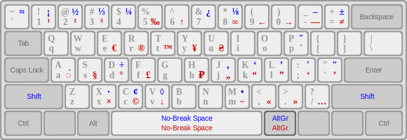

## Typographic Keyboard

Типографская раскладка клавиатуры позволяет вводить дополнительные символы (« » — × ÷ ≠ § и др.), не прибегая к помощи специальных таблиц и без заучивания сложных кодов.

Существующие типографские раскладки сильно отличаются друг от друга и часто содержат разный набор символов. Предлагаемая версия раскладки для Windows соответствует расположению дополнительных типографских символов в большинстве дистрибутивов Linux и позволяет не переучиваться при использовании разных операционных систем.

Цель проекта — создание одинаковых условий для набора текста на компьютерах с Windows и на компьютерах с Linux, поэтому добавление символов, отличающихся от типографской раскладки в Linux, не планируется.

### Как пользоваться

Дополнительные типографские символы вводятся при нажатой клавише <kbd>AltGr</kbd> (правый <kbd>Alt</kbd>) или при нажатых клавишах <kbd>AltGr</kbd> + <kbd>Shift</kbd>.

### Расположение символов

Русская (Типографская), на основе раскладки «Русская».

США (Типографская), на основе раскладки «США».

### Установка и удаление

[Скачать последнюю версию](https://github.com/kamikaze-kun/typographic-keyboard/releases/latest/)

Для установки типографской раскладки запустите `setup.exe` для требуемого языка. После установки настройте необходимое сочетание раскладок в диалоге «Языки и службы текстового ввода» в региональных настройках.

Для удаления используйте стандартные средства Windows. Перед удалением уберите удаляемую раскладку в диалоге «Языки и службы текстового ввода» в региональных настройках.

### Известные проблемы

При вводе дополнительных символов, расположенных на клавише <kbd>L</kbd> (русская <kbd>Д</kbd>), блокируется компьютер как при нажатии <kbd>Ctrl</kbd> + <kbd>Alt</kbd> + <kbd>L</kbd> или <kbd>Windows</kbd> + <kbd>L</kbd>.

### Технические подробности

Типографские раскладки созданы в программе [Microsoft Keyboard Layout Creator 1.4](https://www.microsoft.com/en-us/download/details.aspx?id=22339).

При создании использовались стандартные раскладки Windows с добавлением символов в соответствии с файлом `/usr/share/X11/xkb/symbols/typo` из пакета `xkb-data_2.23.1-1ubuntu1` Ubuntu 18.04.

Версия файлов типографских раскладок в большинстве случаев остаётся 1.0, но к номеру опубликованной версии добавляется количество вошедших в неё раскладок. Например, `Typographic Keyboard 1.0-2` — две раскладки.
